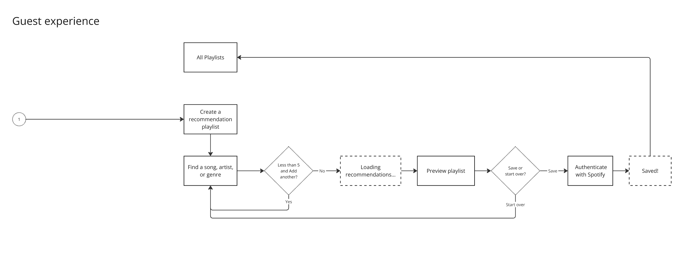
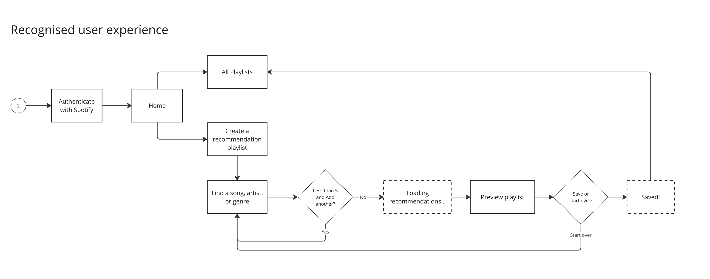
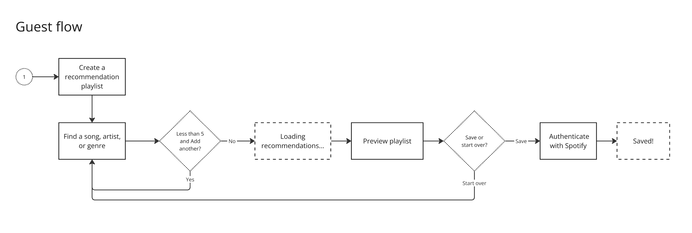
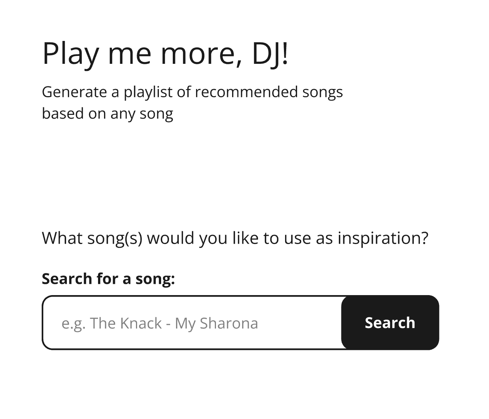
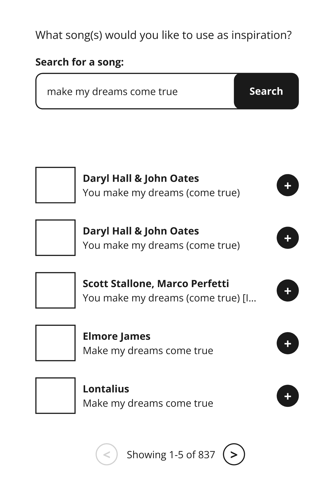
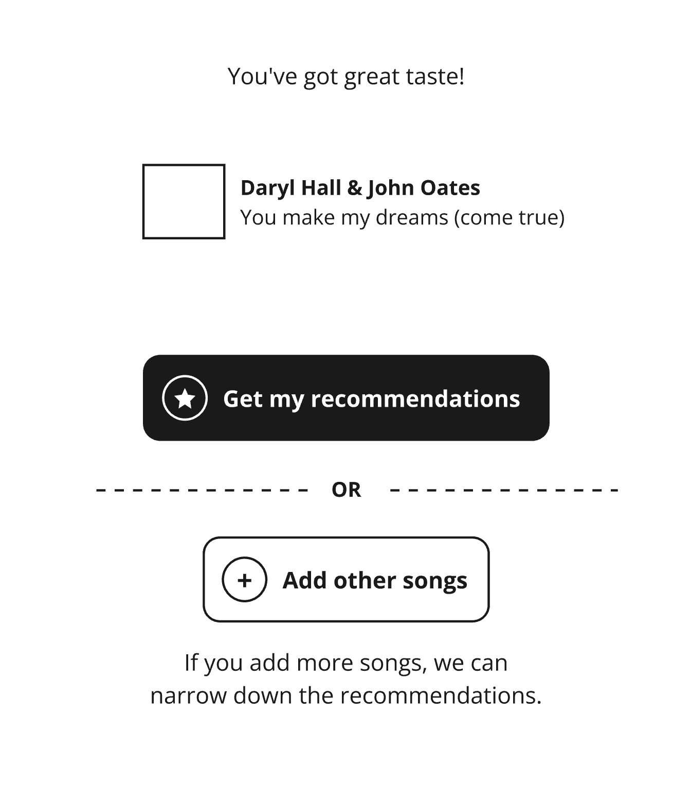
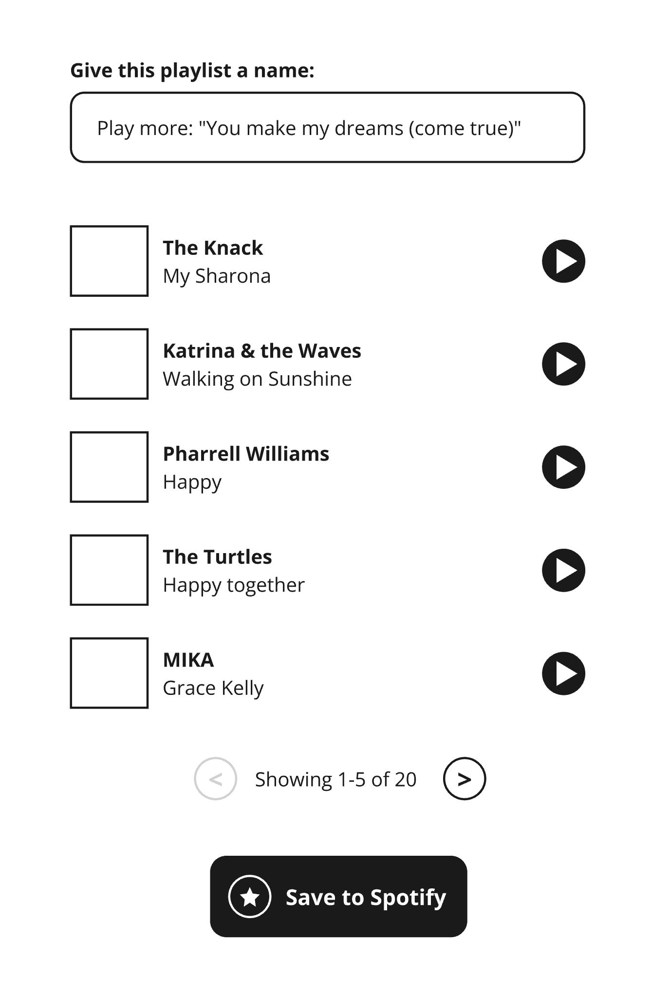
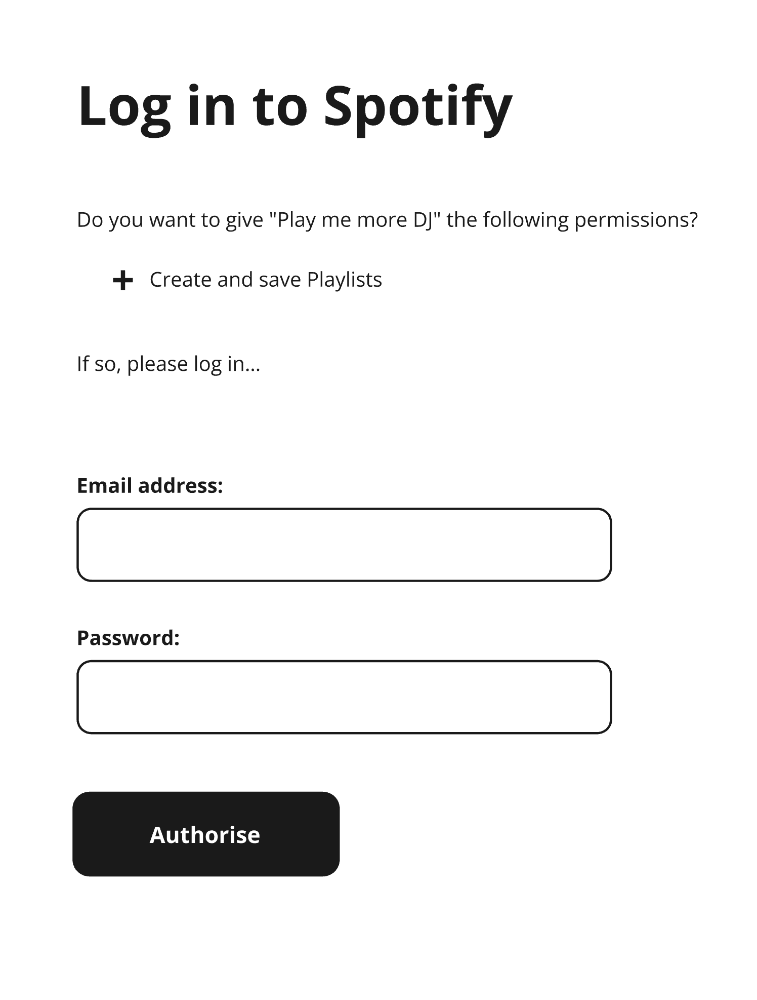
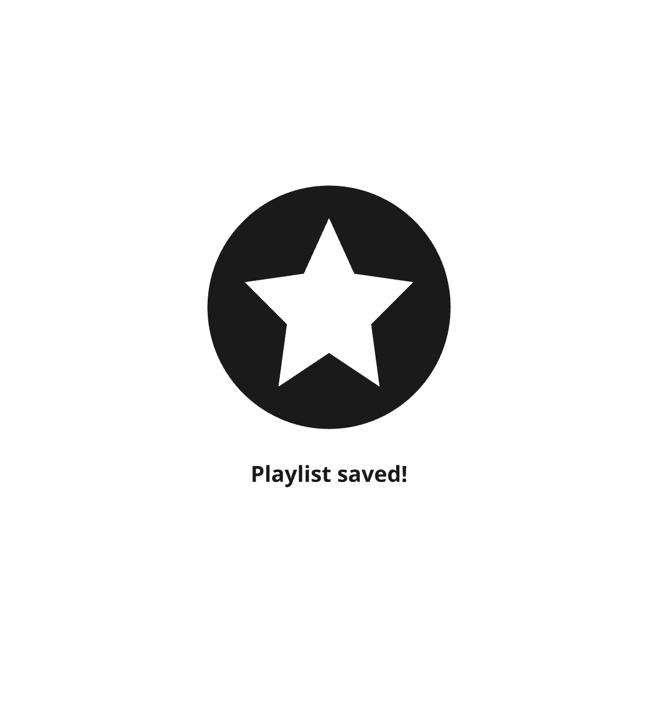

# The journey

This document is to help keep track of my decisions and the paths I took during development of this project, in trying to meet
[The project goals](./goals.md).

## Initial thoughts

The interviewer uses Vue.js in their daily front-end work, but my strengths are situated in web-friendly tech, and in progressive enhancement.
They do use Ruby on Rails on the back-end though, so maybe there's an opportunity here to demonstrate my Rails 7 capabilities.

### Architecture

Some primary concerns:

- **Persistence**:\
  We'll probably want some sort of data persistence here, so that the user can open/close the app and not lose their session and/or playlists
- **Source of truth:**\
  It might be better to represent the user as a Spotify user, using OAuth. This has implications on where we store those credentials.
  Alternatively (and naively), the app could take control in managing the playlists, and the user is a synthetic and anonymous Spotify user. For playback to happen within the app, or for these playlists to be electively saved to Spotify, then we'll need OAuth again.
- **UI State management**:\
  The lo-fi application design might incur state management requirements. e.g. if the App is a do-everything-in-one-screen app, then we'll need very limited state management. But if there are distinct screens that the user has to flip between when finding songs, and managing a playlist, then we might need something to manage those screen dependencies.
  Ultimately, we might be able to get away with having several modes in the app, where everything is loaded into the context at all times.

I'm not a big fan of UI state management on the client. This is usually a signifier that business logic is spread throughout the stack, rather than in one central place (the back-end). Pushing complexity to the client leads to performance implications, brittleness, and longer/larger/more risky development effort in total. [The client environment is a hostile one].

So, with those concerns in mind, let's see if some low-level design work (storyboarding/wireframing) can help us achieve a reasonable outcome.

### Storyboard / Flows

Some questions popped up during mocking up the workflows:

#### 1. Can an anonymous user start forming a new recommended playlist? Or does Spotify take into account a known user's preferences when recommending playlists?

This answer could influence whether the user needs to log in prior to creating their recommendations, which might be less desireable, and has implications on the API use.

It looks like the Spotify Recommendations API doesn't require an associated user.

#### 2. Do we want to prioritise guest users?

A guest user could start seeing immediate value, without having to complete the challenge of authenticating via Spotify first.

Whereas, if the user authenticated first, they'd get a more 'management' experience over their playlists.

The more I think about it, the more I dislike the idea of the 'management' aspects of the application. They also don't gel well with the project goals: A recommendation engine only.

#### 3. Can we simplify this flow?

Certainly.

Let's get rid of the 'all playlists' and 'home' notions, and go with a simple wizard-like flow that saves to your Spotify profile.

### Wireframes

The first draft of the flow looks something like this…

#### 1. Start

Introduce the app, and ask for the first inspirational song.

#### 2. Search results

Show results for the entered search terms.

The user could enter a new term here, or select from one of the songs in the results.

#### 3. Song selected

Once the user has selected at least one song, they can proceed onto generating their new recommendations playlist, or add more songs to further narrow down their recommendations.

#### 4. Loading recommendations

I'm not sure how long it'll take to generate the recommendations, so I thought it prudent to have an interstitial loading screen.

#### 5. Playlist preview

At this point, the user could start playing the playlist, or save the playlist to their Spotify profile.

Show the user first five songs in the recommendations, and give them an opportunity to edit the generated playlist name.

#### 6. Spotify OAuth

If the user hasn't been authenticated prior, then let's use Spotify's OAuth to help us save the playlist against their profile.

This screen could also be used to help with continuous or uninterrupted playback.

#### 7. Playlist saved

Another interstitial screen. This might be better as a toast notification though.

### Requirements

#### Spotify access

I signed up as a Spotify developer, and defined my first app. This'll help me with the API credentials I need later.

The Developer Portal has some handy samples on how to interrogate the API for song recommendations and generating playlists - nice!

#### Local environment

I'll need something running locally, either to simulate a deployed app, or act as the OAuth broker if I go that route.

I'd like to avoid mountains of Node infrastructure though. I wonder how far I can get with that idea in mind?

## Development

Let's dive into development now. [This is what you came for, right? :P]

### Priorities

Let's try get these out first:

1. Set up a bare-bones web server
1. A form-based search Web Component (of songs by title) that initiates requests against the API without errors.
1. Convert an example set of search results (JSON) into a digestible Web Component list.
1. Append an 'Add' button to each of the search results items, and wrap the results in a form.
1. A screen that takes a given song (and associated Spotify Track ID) as input for another form that can handle 1-5 items.
1. A form-based Web Component that initiates a request against the Recommendations API
1. A list Web Component that shows the results of the Recommendations response, and modifies them for input into a Playlist.

[That makes me think there might be special requirements for generating a Playlist. I better check the Create Playlist API]

It looks like the [Create Playlist](https://developer.spotify.com/documentation/web-api/reference/create-playlist) creates an empty playlist. We'll need a multi-phase process to create the Playlist from the Recommendations.

### Spotify endpoints required

We'll need the following functionality:

- [Search for Item](https://developer.spotify.com/documentation/web-api/reference/search)
- [Get Recommendations](https://developer.spotify.com/documentation/web-api/reference/get-recommendations)
- [Create Playlist](https://developer.spotify.com/documentation/web-api/reference/create-playlist)
- [Add tracks to Playlist](https://developer.spotify.com/documentation/web-api/reference/add-tracks-to-playlist)
